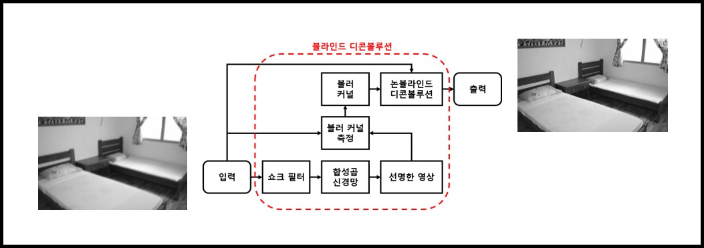

# Project_DeblurCNN
Minso Jeong, IPIU 2018 (2017. 09 ~ 2017. 12)

> [**합성곱 신경망 기반의 균일 모션 블러 제거 기법**](https://www.eiric.or.kr/literature/ser_view.php?SnxGubun=INME&mode=total&searchCate=&more=Y&research=Y&re_q1=&pg=3&gu=INME006A8&cmd=qryview&SnxIndxNum=211764&rownum=26&totalCnt=44&q1_t=7KCV7KCc7LC9&listUrl=L3NlYXJjaC9yZXN1bHQucGhwP1NueEd1YnVuPUlOTUUmbW9kZT10b3RhbCZzZWFyY2hDYXRlPSZxMT0lQzElQTQlQzElQTYlQzMlQTImbW9yZT1ZJmYxPSZyZXNlYXJjaD1ZJnJlX3ExPSZwZz0z&q1=%C1%A4%C1%A6%C3%A2),   
> Minso Jeong,  
> 제 30회 영상처리 및 이해에 관한 워크샵

Contact : [minso.jeong@daum.net](mailto:minso.jeong@daum.net)

## Updates

## Abstract
The uniform motion blur removing algorithm of Cho et al. has the problem in that the edge region of the image cannot be restored clearly. We propose the effective algorithm to overcome this problem by using shock filter that reconstructs a blurred step signal into a sharp edge, and convolutional neural network (CNN) that learns by extracting features from the image. Then uniform motion blur kernel is estimated from the latent sharp image to remove blur in the image. Proposed algorithm improves the disadvantages of the conventional algorithm by reconstructing the latent sharp image using shock filter and convolutional neural network. Through the experimental results, it was confirmed that the proposed algorithm shows excellent reconstruction performance in objective and subjective assessment than the conventional algorithm.

## Result
* PSNR (dB)

|Test Image  (Width * Height)|Test Image|Conventional |Ours|
|:-------------------:|:----------:|:----------:|:----------:|
|Building  (924×616)|22.68|24.08|**26.05**|
|Warehouse  (924×581)|22.28|23.67|**25.13**|
|Field  (924×668)|30.89|31.33|**32.15**|
|Bedroom  (924×583)|28.28|29.13|**32.34**|

* SSIM

|Test Image  (Width * Height)|Test Image|Conventional |Ours|
|:-------------------:|:----------:|:----------:|:----------:|
|Building  (924×616)|0.68|0.77|**0.82**|
|Warehouse  (924×581)|0.58|0.69|**0.74**|
|Field  (924×668)|0.74|0.86|**0.87**|
|Bedroom  (924×583)|0.82|0.89|**0.93**|

## Installation
Comming Soon!

## License

## Citation
